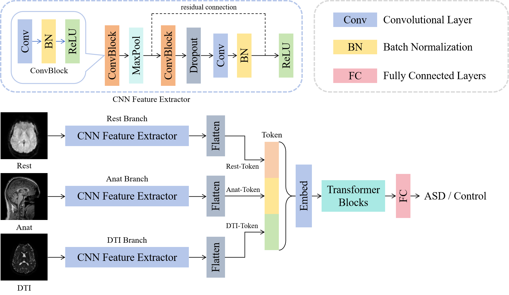

# MRI-GradCAM-ABIDE

This repository contains a PyTorch-based implementation for classifying MRI images from the ABIDE dataset and generating Grad-CAM heatmaps for model interpretability. The project processes three types of MRI images (anat, dti, rest) for each subject, performs binary classification (disease vs. normal), and visualizes important regions using Grad-CAM.

---

## Project Overview

The project is designed to:

* Load and preprocess MRI images from the ABIDE dataset (`datas_mri` directory) and corresponding labels from `labels.csv`.
* Train a deep learning model with three CNN branches (for anat, dti, rest images), followed by a Transformer Encoder and an MLP classification head.
* Generate Grad-CAM heatmaps for each CNN branch's last convolutional layer, overlaying them on the original images with 70% heatmap and 30% original image transparency.
* Package the interpretation results into a ZIP file for easy sharing.

The dataset consists of subjects with folders (e.g., `BNI_29006_1`) containing three subfolders (`anat_1`, `dti_1`, `rest_1`), each with a `qc_t.gif` image. Labels are provided in `labels.csv` with columns `SITE_ID`, `SUB_ID`, and `DX_GROUP` (1 for disease, 2 for normal).

---

## Usage

### 1. Prepare Data

* Place the `datas_mri` directory and `labels.csv` in the project root.
* `datas_mri` should contain subject folders (e.g., `BNI_29006_1`) with subfolders `anat_1/SNAPSHOTS/qc_t.gif`, `dti_1/SNAPSHOTS/qc_t.gif`, and `rest_1/SNAPSHOTS/qc_t.gif`.
* `labels.csv` should have columns `SITE_ID`, `SUB_ID`, and `DX_GROUP` (1 for disease, 2 for normal).

### 2. Train the Model

Run `train.py` to train the model for 100 epochs, splitting the dataset into 8:1:2 (train:val:test). The best model based on validation accuracy is saved as `best_model.pth`.

### 3. Generate Grad-CAM Heatmaps

Run `gradcam.py` to generate heatmaps for each sample's anat, dti, and rest images, overlaid on the original images (70% heatmap, 30% original). Heatmaps are saved in the same directory as the input images (e.g., `datas_mri/BNI_29006_1/anat_1/SNAPSHOTS/gradcam_anat.png`).

---

## Model Details

### Architecture:

* Three CNN branches (5-layer CNN each) for anat (256x256), dti (192x192), and rest (64x64) images.
* Transformer Encoder (4 layers, `d_model=8`, `nhead=4`) to process concatenated CNN features.

---

## License

This project is licensed under the MIT License.
